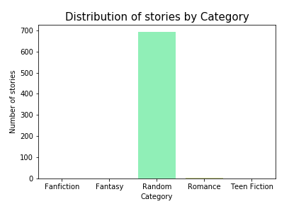
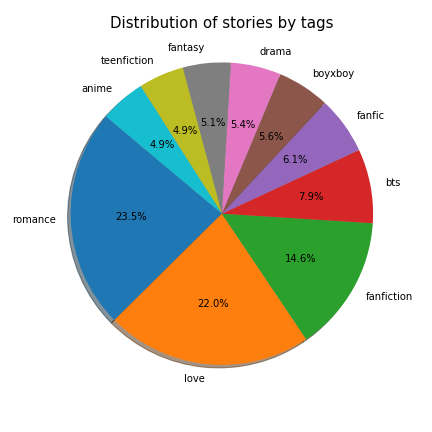
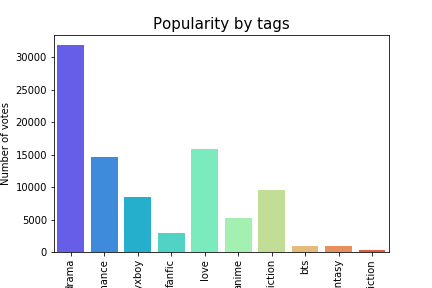
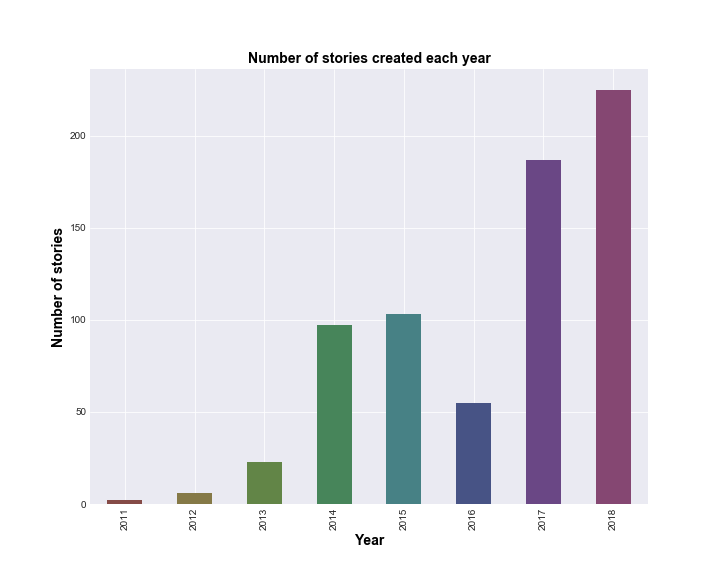
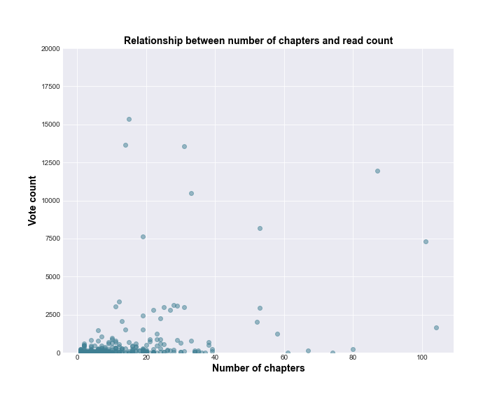
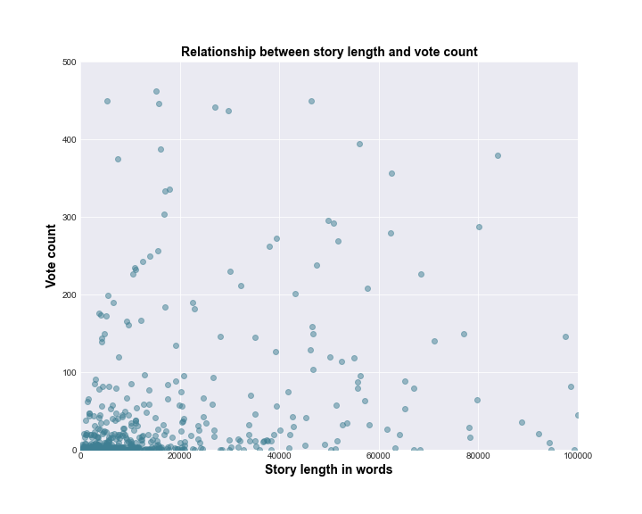
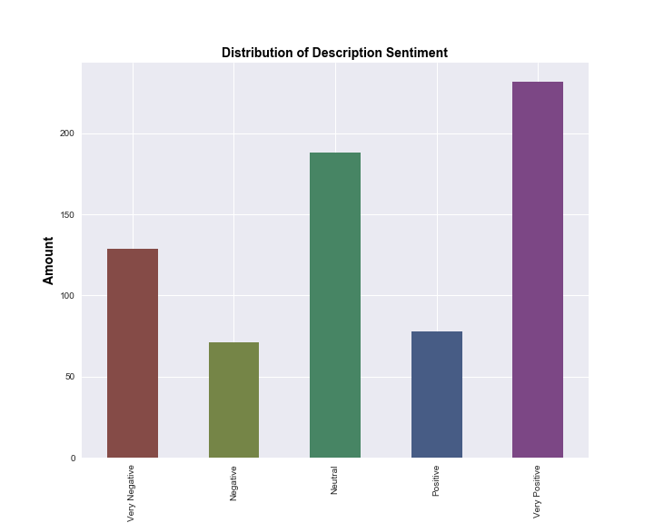
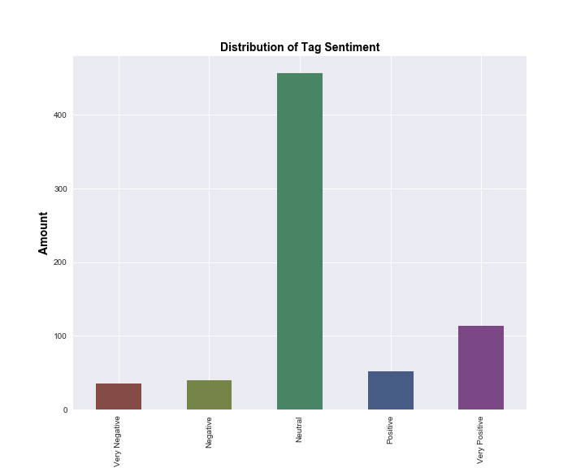

# Project Wattpad


Wattpad takes everything you love about storytelling, and turns it into a social, on-the-go experience. The result is a one-of-a-kind adventure in creation and discovery of stories. In a world of 7-second attention spans, people everywhere still long to be immersed in content that matters to them. The Wattpad community collectively spends an incredible 15 billion minutes each month using Wattpad. Wattpad gives people from around the world access to an audience of millions, and connects them with content they can’t find anywhere else.

Today, the global Wattpad community is made up of more than 65 million people. The company based in Toronto, Canada, but Wattpad stories transcend borders, interests, and language.

## Project Team:
* Rupali Mayekar
* David Richter
* Luke Pharr
* Andrea Karaffa

## Motivation and Summary:
The hypothesis of the our project was that Wattpad was a good source to explore trends in today's content reading and content creation. This and the research questions posed stemmed from a desire to understand the scale of use for mobile reading and content creating, what readers like reading and if there were key trends to identify whether a story would be popular. 

Wattpad provides an API to get insight into the data they are generating. We decided to use this data to answer our questions.

## Questions we proposed to answer:

1. Mean story popularity by category by read count, vote count, comment count?
2. Number of stories created each year based on creation date?
3. Average time to finish a story? Search for completed stories, take difference between modify and create date.
4. Average number of parts per story (for completed stories)?
5. What are the most popular categories?
6. What are the most popular languages?
7. Does length of read count correlate to a certain story length? Does read count correlate to number of parts per story?
8. Sentiment Analysis of Description
9. Average popularity by story rating (true or false).

## Getting the Data
The Wattpad API is still in under development so it provides very limited ways to get to the data. The major content of the data is referred to as ```stories```. Wattpad users create stories and each story can have multiple chapters/parts. Stories are written in different languages and are categorized into Categories. The API returns json data. There are 3 main sets of information we were able to retrieve from the API:

### Stories
This endpoint contains the bulk of the data. As the API is still in beta, results seemed random and upredictable. Our api call aimed for 100 pages of 100 stories each, but the most we could get was roughly 1400 at a time. The results change daily, and and only cover a few of the 24 possible genres. To counteract this, we ran the search for only "new" stories, which gave us a much more diverse dataset. We pulled this json data and dumped it into a csv file.

### Categories
The categories are simply an id-name list of story categories in json format. We got these two columns and created a csv file with the categories.

### Languages
The languages are a simple list of id-name list of Languages. We got these two columns and created a csv file with the languages.

### Conclusion on the API
Initially the data that we recieved from the API seemed limited, did not have stories in multiple categories and languages but by making repeated calls modifying the filter parameters, we were able to get stories in multiple categories. 

### Limitations:
* The api does not provide any user data
* The story data does not represent a good sample of all the stories in Wattpad
* The stories were mainly in English. We did not get stories in other languages
* The API has a cap on the number of stories it gives us. We could only pull about 1400 stories when Wattpad has millions.

## Cleaning the Data
The first step was to take all the csv files, one from each day we pulled data, plus the data filtered for "new", and consolidate them into one csv. Next, all duplicates were removed. This data was then prepped for visualization by removing blanks and 'NaN' values.

## Creating the plots
We attempted to create the following plots:

### Q1 - Mean story popularity by category by read count, vote count, comment count?

#### Story distribution by Categories
Provides us a distribution of stories by categories. Our initial data set had all stories in the "Random" category. Later we were able to get more stories in different categories. 




#### Story distribution by Tags
Since our initial data did not have stories in different categories, we looked at how they were distributed by tags. We then looked at the 10 most popular tags for our analysis. The story distribution by tags seemed more sensible.




#### Story populaarity by Tags
We gathered the readCount (how many times a story was read), commentCount (How many comments a story got) and voteCount (How many votes a story got) for all the stories divided by categories as well as tags. The results showed that in both scenarios, Romace/Love and Fanfiction were the most popular types of stories. Here is one of the analysis:




### Q2 - Number of stories created each year based on creation date?
Provides insight into number of stories per year since Wattpad was launched



### Q3 - Average time to finish a story? Search for completed stories, take difference between modify and create date.

* Average days to complete story post is 244 days
* Average number of chapters in a story is 12
* Average number of words in a story is 75,265

### Q4 - Average number of parts per story (for completed stories)?


### Q5 - What are the most popular categories?

Refer to ---Story distribution by Categories--- in plots for Q1 above

### Q6 - What are the most popular languages?
It looks like the data we get from the api have stories that are all in English, even though we know that there are a lot more stories on Wattpad in other languages. This is one of the limitation of the api that we discovered. 

### Q7 - Does length of read count correlate to a certain story length? Does read count correlate to number of parts per story?

We found that story length does not appear to relate to story popularity.






### Q8 - Sentiment Analysis of Description
We did a sentiment analysis on story tags and story desctiptions and compared the two. We found that:
* Sentiment between story tags and description is not consistent
* Description sentiment is likely more representative of the story because the averaged tag sentiment causes multiple sentiments to be averaged out






### Q9 - Average popularity by story rating (true or false)
Story rankings are based on an algorithm that is very complex and changes all the time. In the most basic terms, a story’s ranking is determined by the strength of recent support in the community. The more support a story receives, the higher its hotness will be during this time. If the support for the story trails off over time, its ranking will decrease. 

We explored the relationship of these rankings (story rating in the data) with the average votes


### Conclusion
In general it appears that a lot of people like to read and write content online. The favourite types of stories were Romance/love and Fanfiction. The number of stories are increasing each year. There are more short stories and the shorter ones seem to be read more. The description sentiment is more likely to represent the story. Wattpad gives a story a higher rating based on its popularity.  

The Data that Wattpad provides via the api is not a good sample of the complete data that they have. There is a lot more analysis that can be done, for example exploring story parts.

If Wattpad provided user data, we could also look into user demographics and what users from different countries read, or how stories are distributed by age groups in terms of writing or reading them.